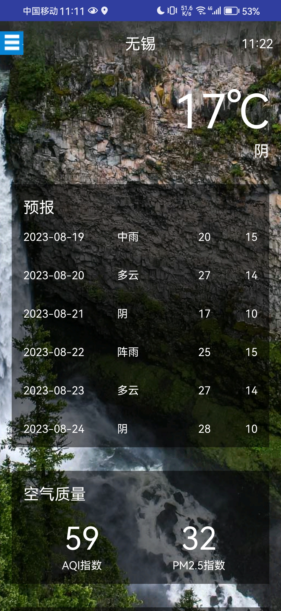
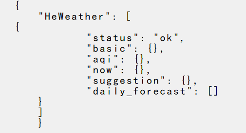
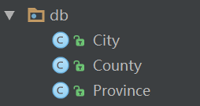

# 开发酷欧天气



## 1. 功能需求以及技术可行性分析

 1.1 功能需求：

 	1. 可以罗列出全国所有的省市县；
 	2. 可以查看全国任意城市的天气信息；
 	3. 可以自由地切换城市，查看其他城市的信息;
 	4. 提供手动更新以及后台更新天气的功能；

1.2 技术可行性分析

1. 全国省市县的数据信息：http://guolin.tech/api/china

   省Json数据格式如图所示：

   ```json
   [
       {
           "id": 1,
           "name": "北京"
       },
       {
           "id": 2,
           "name": "上海"
       },
       {
           "id": 3,
           "name": "天津"
       },
       ...
   ]
      
   ```

   市和县的信息类似。

   county:

   ```json
   [
       {
           "id": 751,
           "name": "运城",
           "weather_id": "CN101100801"
       },
       {
           "id": 752,
           "name": "临猗",
           "weather_id": "CN101100802"
       },
       {
           "id": 753,
           "name": "稷山",
           "weather_id": "CN101100803"
       },
       {
           "id": 754,
           "name": "万荣",
           "weather_id": "CN101100804"
       },
       ...
    ]
   ```

   

2. 每个城市的天气信息：和风天气提供的api，每天提供免费3000次请求；

   1. 先注册和风天气，然后获得key

   2. 访问如下接口即可查看城市的天气信息：

      ```html
      http://guolin.tech/api/weather?cityid=CN101100804&key=和风天气的key
      ```

   3. 返回天气信息的大致格式：

      


## 2. 使用git--将代码托管到Github上

1. git clone https://github.com/HosheaSun/coolWeather.git

2. 进入coolWeather文件夹，把所有的文件都粘贴到上一层目录中，其中注意.git是一个隐藏文件，别忘记粘贴；复制完之后，删除coolWeather文件夹。

3. 然后将项目中现有的文件提交到Github上。

   ```java
   git add .
   git commit -m "First Commit提交信息"
   git push origin main/master//推送到github上
   ```

## 3. 创建数据库和表

 	1. 创建几个包--让项目有更好的项目结构
     1. db--创建数据库模型相关的代码
     2. gson--存放gson模型相关代码
     3. service--存放服务相关代码
     4. util--存放工具相关代码

2. 将服务器获取到的数据存储到本地，创建数据库和表，数据持久化，使用LitePal来管理和操作数据库。

   1. app/build.gradle将依赖库引入到dependencies闭包中:

      ```java
      dependencies {
          compile fileTree(dir: 'libs', include: ['*.jar'])
          androidTestCompile('com.android.support.test.espresso:espresso-core:2.2.2', {
              exclude group: 'com.android.support', module: 'support-annotations'
          })
          compile 'com.android.support:appcompat-v7:24.2.1'
          testCompile 'junit:junit:4.12'
              
          compile 'org.litepal.android:core:1.4.1'//对数据库进行操作
          compile 'com.squareup.okhttp3:okhttp:3.4.1'//进行网络请求
          compile 'com.google.code.gson:gson:2.7'//解析GSON数据
          compile 'com.github.bumptech.glide:glide:3.7.0'//加载和展示图片
      }
      ```

   2. 引入依赖库之后，设计数据信息，对应的实体类，下边是City类的具体代码，County和Province的代码类似。

      

      ```java
      public class City extends DataSupport {//LitePal的每个实体类都需要继承DataSupport
          private int id;//每个实体类都会有的字段
          private String cityName;//城市的名字
          private int cityCode;//城市的代号
          private int provinceId;//该城市所属省的代号
      
      	//下边是getXxx()和setXxx()方法
          public int getId() {
              return id;
          }
      
          public void setId(int id) {
              this.id = id;
          }
      
          public String getCityName() {
              return cityName;
          }
      
          public void setCityName(String cityName) {
              this.cityName = cityName;
          }
      
          public int getCityCode() {
              return cityCode;
          }
      
          public void setCityCode(int cityCode) {
              this.cityCode = cityCode;
          }
      
          public int getProvinceId() {
              return provinceId;
          }
      
          public void setProvinceId(int provinceId) {
              this.provinceId = provinceId;
          }
      }
      ```

   3. 创建好对应的实体类，需要配置litepal.xml文件，将获取到的数据信息映射为对应的实体类，创建assets目录,然后新建litepal.xml文件，文件内容如下：

      ```xml
      <litepal>
          <dbname value="cool_weather"/>数据库名称
          <version value="1"/>//版本号
          <list>
              <mapping class="com.shc.org.coolweather.db.Province"/>//映射的实体类
              <mapping class="com.shc.org.coolweather.db.City"/>
              <mapping class="com.shc.org.coolweather.db.County"/>
          </list>
      </litepal>
      ```

   4. 最后配置LitePalApplication，AndroidManifest.xml

      ```xml
        <application
              android:name="org.litepal.LitePalApplication"//这里配置LitePal
              android:allowBackup="true"
              android:icon="@mipmap/logo"
              android:label="@string/app_name"
              android:supportsRtl="true"
              android:theme="@style/AppTheme">
              <activity android:name=".MainActivity">
                  <intent-filter>
                      <action android:name="android.intent.action.MAIN" />
                      <category android:name="android.intent.category.LAUNCHER" />
                  </intent-filter>
              </activity>
              <activity android:name=".WeatherActivity" />
      
              <service
                  android:name=".service.AutoUpdateService"
                  android:enabled="true"
                  android:exported="true">
              </service>
          </application>
      ```

      

   